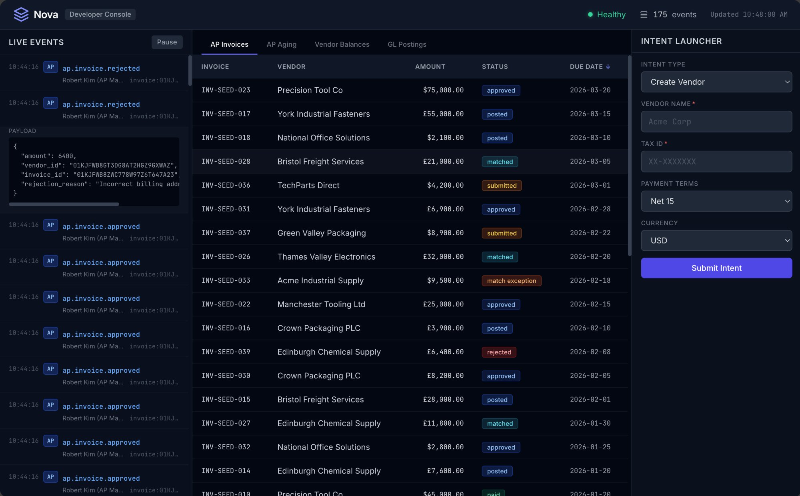
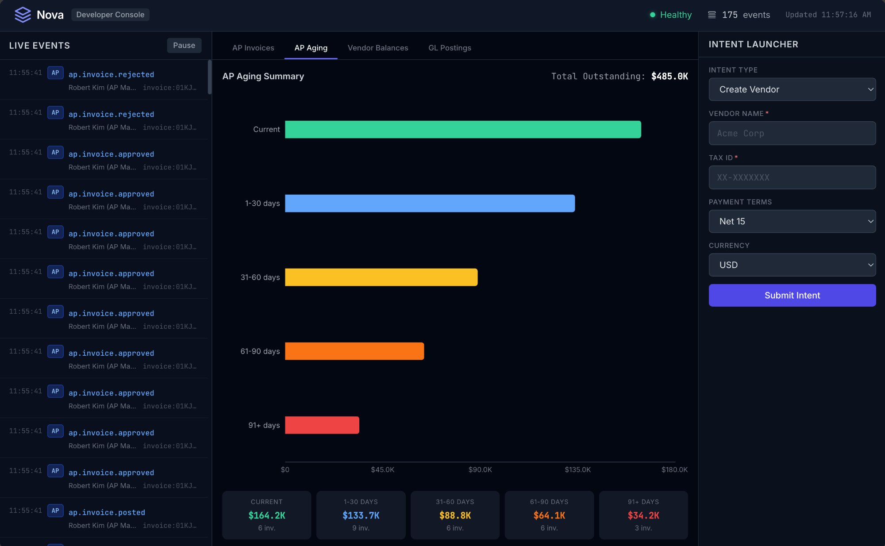
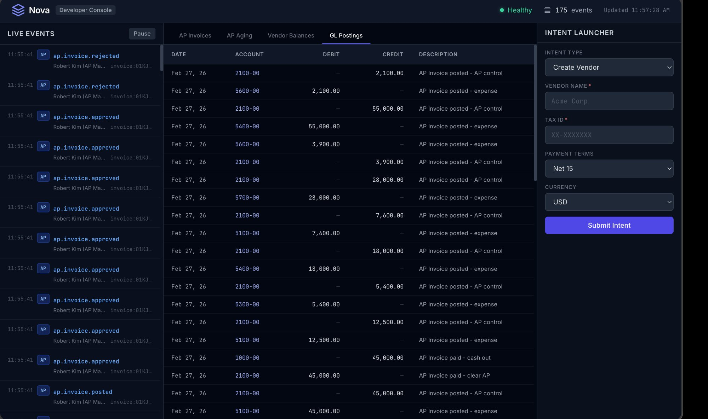
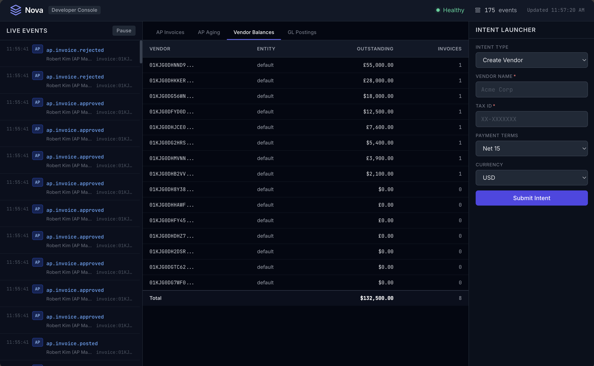

# Nova ERP

**An open-source ERP engine built from first principles, where AI agents are first-class participants — not bolt-on tools.**

Nova rethinks enterprise software for the age of autonomous systems. Instead of bolting AI onto a 1990s database architecture, Nova starts with an event-sourced, append-only core where every state change is an immutable fact. Humans, AI agents, robots, and IoT devices all interact through the same intent protocol, governed by the same rules, with the same audit trail.

---

## See It In Action

Nova ships with a developer dashboard, demo walkthrough, and seed data so you can explore a working procure-to-pay cycle immediately.

```bash
git clone https://github.com/mcarvalho21/nova.git
cd nova
pnpm install
pnpm demo:setup    # Start server + migrate database
pnpm seed          # Populate with 15 vendors, 30 POs, 40 invoices across 2 legal entities
pnpm dashboard     # Open developer console at localhost:5173
```

### Developer Console

**AP Invoice Lifecycle** — 40 invoices across every lifecycle state, from submitted to paid:



**AP Aging Analysis** — Outstanding payables aged by bucket with color-coded visualization:



**GL Postings** — Double-entry journal entries generated automatically from AP events:



**Vendor Balances** — Outstanding balances per vendor across legal entities:



### CLI Demo

Run `pnpm demo` to watch a narrated walkthrough of the full AP invoice lifecycle — vendor creation, purchase order, invoice submission, 3-way matching, approval routing with segregation of duties, GL posting, and payment — all through the intent protocol with real-time output.

---

## Why Nova?

Traditional ERPs were designed for humans entering data into forms. They store mutable rows in relational tables, bolt on audit trails as an afterthought, and treat AI as an external integration. This creates fundamental problems:

- **No reliable history.** Mutable tables overwrite previous state. "What was the inventory level on March 15?" requires complex audit reconstruction.
- **AI as second-class citizen.** AI tools access the system through the same APIs as external integrations, with no native concept of agent identity, trust levels, or autonomous operation boundaries.
- **Rigid schemas.** Adding a field or changing a business rule requires schema migrations, downtime, and careful coordination.
- **Audit gaps.** Trigger-based audit tables capture what changed but not why, who approved it, or what rules were evaluated.

Nova solves these by making different foundational choices:

| Traditional ERP | Nova |
|----------------|------|
| Mutable rows are the source of truth | Immutable events are the source of truth |
| Audit trails bolted on via triggers | Complete audit trail by construction |
| AI accesses system via external APIs | AI agents are native participants with identity and boundaries |
| Schema changes require migrations | Event schema evolves via upcasting; projections are rebuildable |
| Business rules embedded in application code | Declarative rules engine with versioning and evaluation tracing |
| One way to read data (query the tables) | Multiple projections from the same events, each optimized for its use case |

---

## Architecture at a Glance

Nova's core is five engine components that work together:

```
                    ┌─────────────────────────────────────┐
                    │          INTENT PROTOCOL             │
                    │  (receive → validate → plan →        │
                    │   approve → execute)                 │
                    └──────────────┬──────────────────────┘
                                   │
                    ┌──────────────▼──────────────────────┐
                    │          RULES ENGINE                │
                    │  (validate conditions, enforce       │
                    │   policies, route approvals)         │
                    └──────────────┬──────────────────────┘
                                   │
              ┌────────────────────┼────────────────────┐
              │                    │                     │
   ┌──────────▼────────┐  ┌───────▼────────┐  ┌────────▼───────┐
   │   EVENT STORE      │  │  ENTITY GRAPH  │  │  PROJECTION    │
   │  (append-only      │  │  (flexible     │  │  ENGINE        │
   │   immutable log)   │  │   schema       │  │  (materialized │
   │                    │  │   entities)    │  │   views, CQRS) │
   └────────────────────┘  └────────────────┘  └────────────────┘
```

**Event Store** — Append-only, immutable log. Every state change is a permanent fact. Partitioned by legal entity. Crypto-shredding for GDPR compliance.

**Entity Graph** — Flexible-schema entities with typed relationships. Vendors, invoices, items, employees — any business object, with attributes that can vary by configuration.

**Rules Engine** — Declarative business rules with phased evaluation (validate → enrich → decide → post-commit). Rules are versioned, effective-dated, loaded from YAML configuration, and produce audit traces showing exactly which conditions were checked and what actions were taken.

**Projection Engine** — Materialized views built from events. Trial balance, AP aging, inventory on hand — each projection is optimized for its query pattern. Projections are rebuildable from events at any time. Supports snapshot creation, restoration, and invalidation on back-dated events.

**Intent Protocol** — The universal interaction pattern. Every state change flows through: receive → authenticate → authorize → validate → plan → approve → execute. Humans, APIs, system events, and AI agents all use the same pipeline with the same security, audit, and governance.

---

## Benchmarks

Phase 0 stress tests validated on PostgreSQL 16 with automated gate criteria:

| Metric | Result | Target |
|--------|--------|--------|
| Event throughput | **5,494 events/sec** per partition | 2,000 |
| Projection lag (p99) | **3.07 ms** | < 1,000 ms |
| Concurrent intents | **33/50 succeed**, zero lost updates | 50 concurrent |
| Idempotency | **10,000/10,000** duplicates detected | Zero double-postings |
| GL reconciliation | **$0.00 variance** across 500 lifecycles | Zero variance |
| Projection rebuild | **1,744 events/sec** (1M in ~9.5 min) | 1M in < 10 min |

Full gate report: PASS-TARGET achieved across all criteria. See [`docs/reference/NFR.md`](docs/reference/NFR.md) for tiered pass definitions.

---

## Key Design Decisions

Nova's architecture is documented through 18 Architecture Decision Records (ADRs) in [`docs/architecture/ADR_LOG.md`](docs/architecture/ADR_LOG.md). The most consequential decisions:

- **Event sourcing as system of record** — not CRUD with audit bolted on (ADR-001)
- **PostgreSQL for all storage at MVP** — polyglot persistence is a scale-up path, not day-one complexity (ADR-002)
- **Crypto-shredding for PII deletion** — per-subject encryption keys; destroy key = erase data without modifying immutable events (ADR-004)
- **TypeScript end-to-end** — one language, fast iteration; extract hot paths to Rust when profiling data justifies it (ADR-005)
- **LLM as planner, system as authority** — AI agents reason and propose; deterministic rules validate and decide (ADR-012)
- **Walking skeleton development** — build thin slice through all components first, then deepen (ADR-016)

Each ADR includes context, rationale, alternatives considered, and consequences.

---

## Project Status

Nova has completed **Phase 0 — Foundation Engine**. The architecture has been through three independent reviews, validated by stress tests, and proven with a real business process.

### What's Working Now

| Capability | Status | Details |
|-----------|--------|---------|
| Event Store | ✅ Running | Append-only log, idempotency, concurrency control, schema versioning, multi-partition |
| Entity Graph | ✅ Running | Flexible schemas, relationships, optimistic concurrency |
| Rules Engine | ✅ Running | YAML config, effective dating, phased evaluation, audit traces |
| Projection Engine | ✅ Running | Real-time updates, rebuild from replay, snapshots, dead-letter handling |
| Intent Protocol | ✅ Running | Full pipeline with JWT auth, capabilities, approval workflows, SoD |
| AP Invoice Lifecycle | ✅ Running | Submit → 3-way match → approve → post GL → pay (complete P2P cycle) |
| Developer Dashboard | ✅ Running | Real-time event stream, projection views, intent launcher |
| Stress Tests | ✅ Passing | 8 tests, PASS-TARGET achieved |
| **Total Tests** | **118 passing** | Unit + integration + stress |

### What's Next

| Phase | Focus | Status |
|-------|-------|--------|
| Phase 1 | Governance — full security model, privacy engine with production KMS crypto-shredding, audit engine, RLS on all projections | Next |
| Phase 2 | Organization + Finance — multi-legal-entity, financial dimensions, full GL, full AP | Planned |
| Phase 3+ | Broader capabilities — AR, procurement, inventory, warehouse, production, CRM, agent framework | Planned |

See [`docs/roadmap/BUILD_PLAN.md`](docs/roadmap/BUILD_PLAN.md) for the detailed plan.

---

## Quick Start

### Prerequisites

- Node.js 20+ LTS
- pnpm 8+
- Docker (for PostgreSQL via Testcontainers)

### Run Everything

```bash
git clone https://github.com/mcarvalho21/nova.git
cd nova
pnpm install

# Option 1: Full demo experience
pnpm demo:setup              # Start server + migrate
pnpm seed                    # Populate with realistic data
pnpm dashboard               # Open developer console

# Option 2: Run tests
pnpm test                    # Unit tests (39 tests)
pnpm test:int                # Integration tests (79 tests, requires Docker)
pnpm test:stress             # Stress tests (8 tests, requires Docker, takes ~5 min)

# Option 3: Interactive demo
pnpm demo:setup              # Start server + migrate
pnpm demo                    # Narrated AP invoice walkthrough
```

---

## Documentation

| Document | Audience | Purpose |
|----------|----------|---------|
| [`docs/guides/CONCEPTS.md`](docs/guides/CONCEPTS.md) | Everyone | Core concepts explained: events, entities, rules, projections, intents |
| [`docs/architecture/OVERVIEW.md`](docs/architecture/OVERVIEW.md) | Architects, senior engineers | Full architecture specification |
| [`docs/architecture/ADR_LOG.md`](docs/architecture/ADR_LOG.md) | Architects, contributors | Every major design decision with rationale |
| [`docs/specs/`](docs/specs/) | Implementers | Deep implementation specs (TypeScript interfaces, PostgreSQL schemas, APIs) |
| [`docs/reference/REVIEW_SYNTHESIS.md`](docs/reference/REVIEW_SYNTHESIS.md) | Reviewers, contributors | How the architecture was validated and refined |
| [`docs/reference/NFR.md`](docs/reference/NFR.md) | Operations, contributors | Performance targets and phase gate criteria |
| [`docs/roadmap/BUILD_PLAN.md`](docs/roadmap/BUILD_PLAN.md) | Contributors | What's being built, in what order, with what acceptance criteria |

---

## Tech Stack

| Component | Technology | Rationale |
|-----------|-----------|-----------|
| Language | TypeScript (strict mode) | Single language end-to-end; fast iteration; see ADR-005 |
| Runtime | Node.js 20+ LTS | I/O-bound workloads; worker threads for CPU-bound tasks |
| Database | PostgreSQL 16+ | Event store, entity graph, and projections — all in one; see ADR-002 |
| API | Fastify | High-performance HTTP with schema validation |
| Dashboard | React + Tailwind + Recharts | Developer console for visualization |
| Package manager | pnpm | Workspace-aware, fast, disk-efficient |
| Testing | Vitest + Testcontainers | Unit + integration with real PostgreSQL in Docker |

---

## Contributing

Nova welcomes contributors — especially those with experience in ERP systems, event sourcing, distributed systems, or enterprise AI.

See [`CONTRIBUTING.md`](CONTRIBUTING.md) for guidelines, and [`docs/roadmap/BUILD_PLAN.md`](docs/roadmap/BUILD_PLAN.md) for what's being built now.

### Good First Contributions

- **Review a spec** — Read an implementation spec and file issues for gaps, ambiguities, or mistakes
- **Write a queued spec** — The Document Index shows 40 specs still to be written, each with a clear scope
- **Implement a component** — Pick a spec, build it, test against acceptance criteria
- **Add industry knowledge** — ERP domain expertise (manufacturing, distribution, retail) is as valuable as code

---

## License

Nova is licensed under [AGPL-3.0](LICENSE) for the engine and application code. Documentation and specifications are licensed under [CC BY 4.0](https://creativecommons.org/licenses/by/4.0/).

This means:
- **You can** use, modify, and distribute Nova freely
- **You can** build commercial products on Nova
- **If you modify** the engine and offer it as a service, you must share your modifications under the same license
- **Documentation** can be freely shared and adapted with attribution
